<!--more-->


# 利用GitHub 创建个人博客

## 一、在GitHub上面创建一个名为yourname.github.io的一个仓库




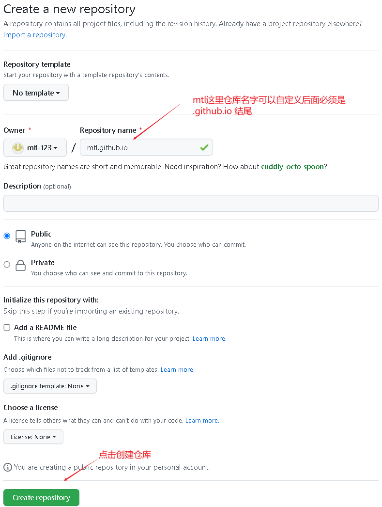


## 二、仓库创建成功

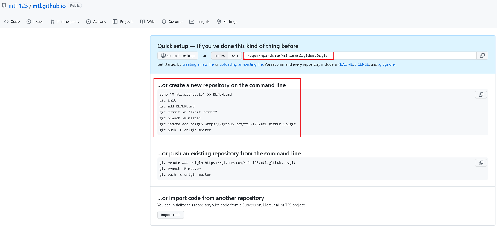

三、使用github Jekyll 来创建博客框架代码

1. 需先在本地电脑安装 git   和 ruby 工具

2. [使用 jekyll 开始建站](https://docs.github.com/cn/pages/setting-up-a-github-pages-site-with-jekyll/creating-a-github-pages-site-with-jekyll)

3. `jekyll new --skip-bundle  --force .` 会生成基础博客框架

   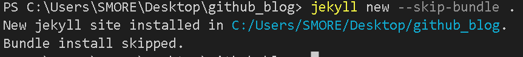


4. 生成的博客框架代码

   

   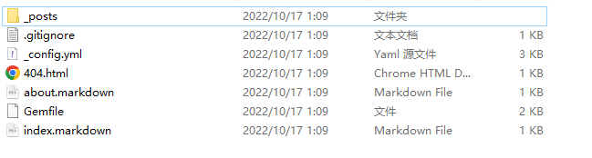

5. 编辑博客框架，打开 Jekyll 创建的 Gemfile 文件，

6. 将“#”添加到以 `gem "jekyll"` 开头的行首，以注释禁止此行。

   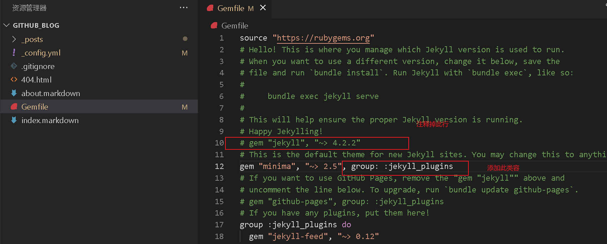

   将gem -v 的版本号 写入上图的Gemfile文件中的第10行 ` gem "minima", "~> 3.2.33"`

   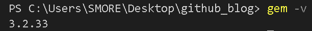

7. 开始构建 `bundle install`

   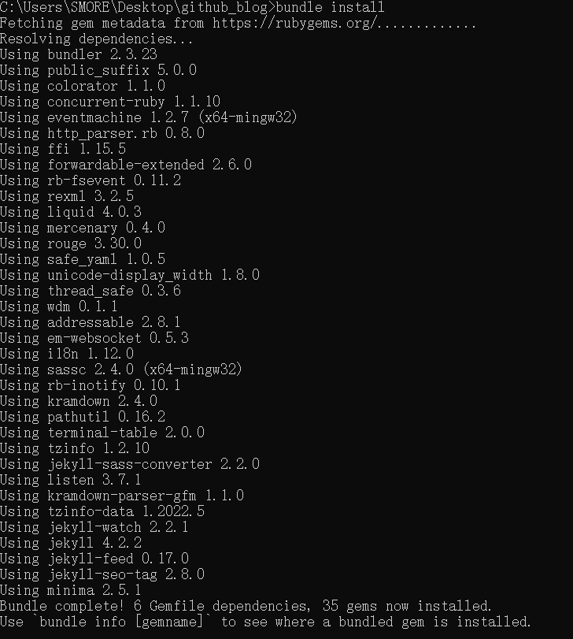

8. 编辑_config.yml 文件

   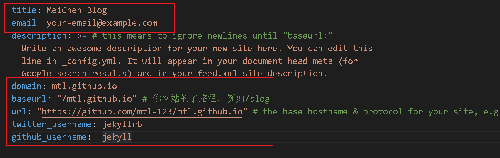

9. [本地运行站点](https://docs.github.com/cn/pages/setting-up-a-github-pages-site-with-jekyll/testing-your-github-pages-site-locally-with-jekyll) `bundle install`

   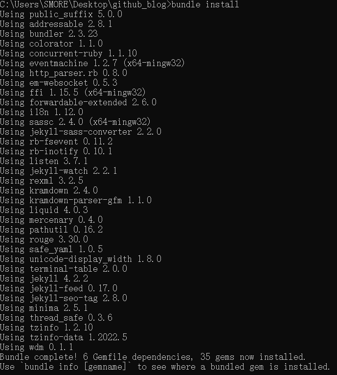

10. `bundle add webrick`

11. 启动运行站点 `bundle exec jekyll serve --trace --watch`

    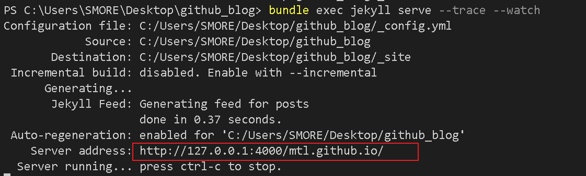

12. 浏览器访问 http://127.0.0.1:4000/mtl.github.io/

    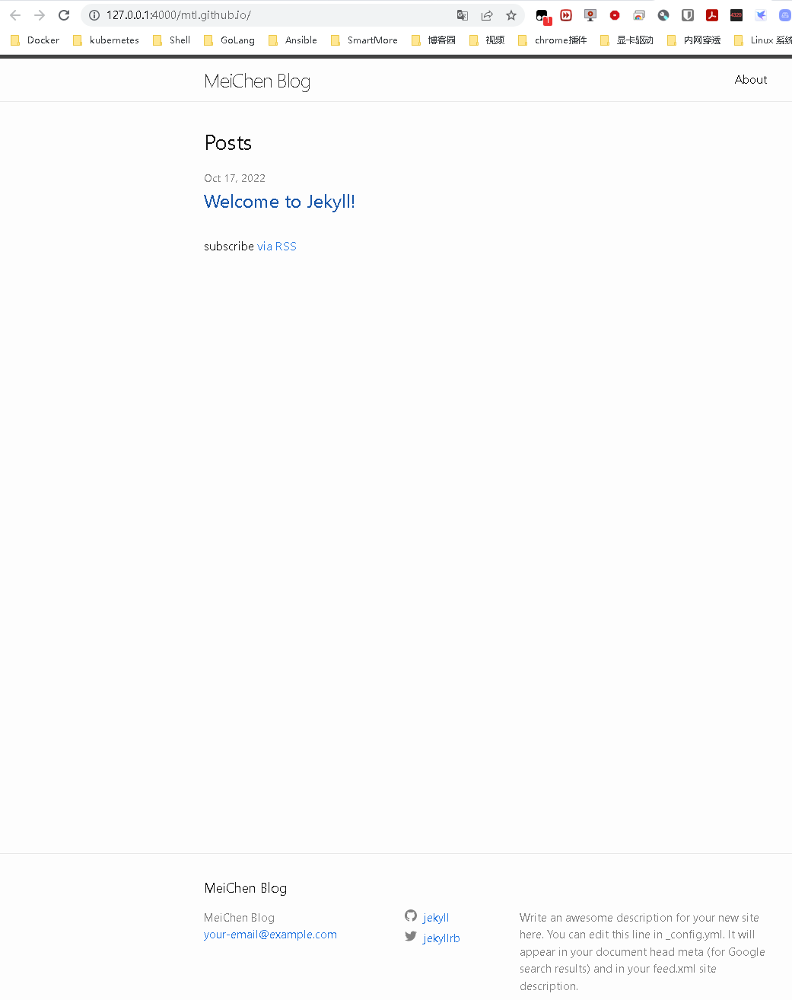

    

13. 如上图本地测试访问成功，即可提交代码到github的 `https://github.com/mtl-123/mtl.github.io.git` 仓库中了

    ```bash
    git config --global core.autocrlf false
    git add .
    git commit -m "add github blog"
    git push https://github.com/mtl-123/mtl.github.io.git master
    ```

    

14. 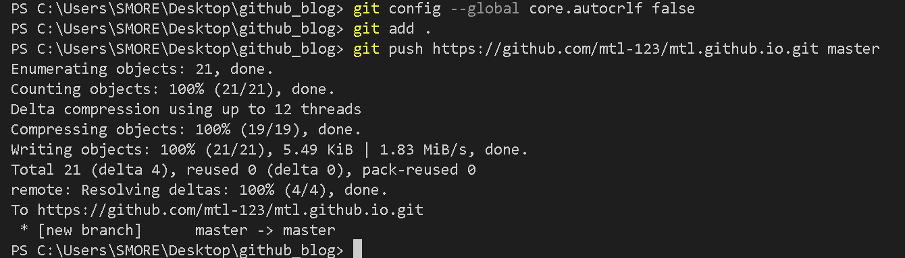

15. 访问github查看代码已经提交上去了

    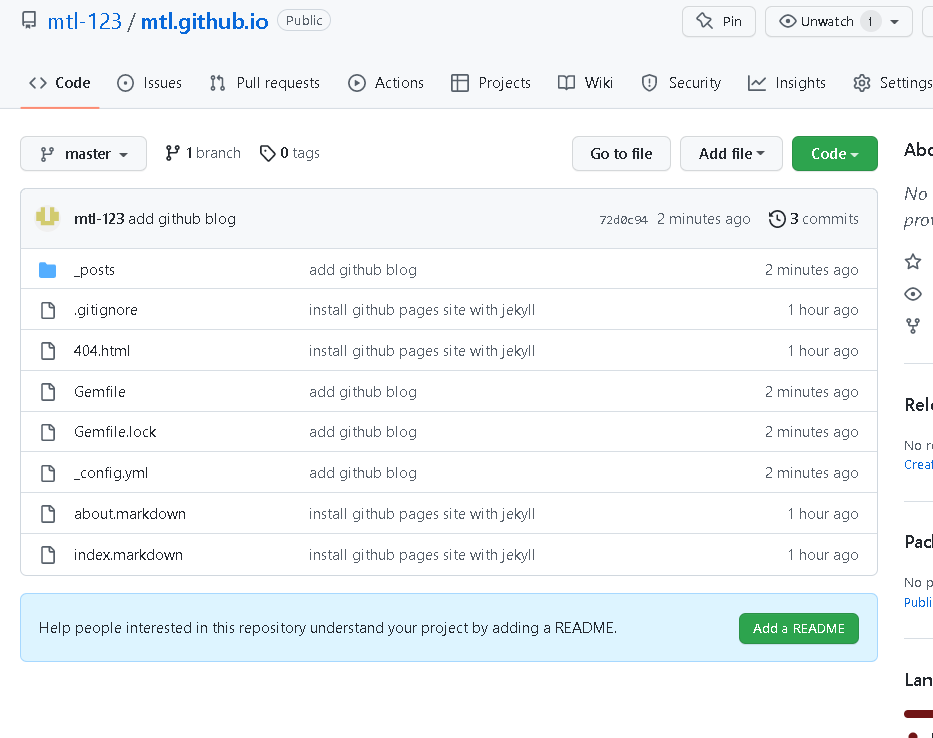

16. 配置github 自动化部署 我这里是使用的 jekyll 框架，所以这里要选择 jekyll using Docker image 进行部署

​    

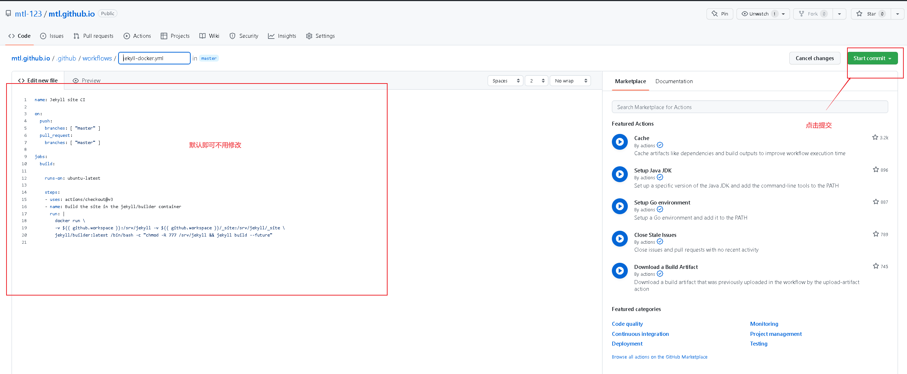

​    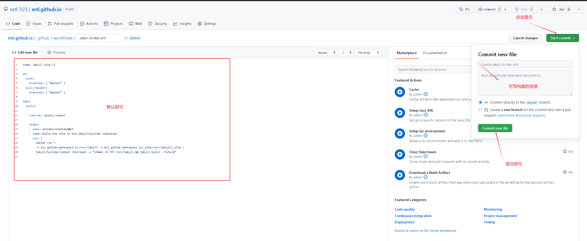


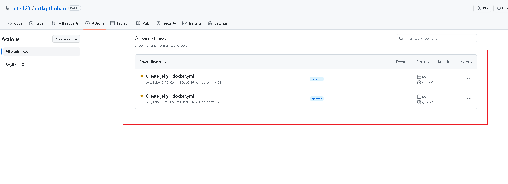


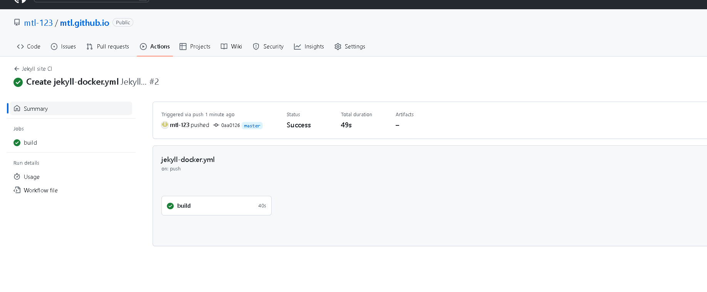

