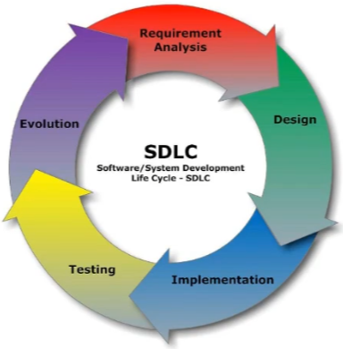

1、持续集成及Jenkins介绍

<!--more-->





# 软件开发生命周期

软件开发生命周期又叫做 SDLC (Software Development Life Cycle), 它集合了计划、开发、
测试和部署过程的集合。如下图所示：

- 需求分析

这是生命周期的第一阶段，根据项目需求，团队执行一个可行性计划的分析。
项目需求可能是公司内部或者客户提出的。这阶段主要是对信息的收集，也有可能是对现有的项目改善和从新做一个新的项目。
还要分析项目的预算多长，可以从哪方面受益及布局，这也是项目创建的目标。

--- 

- 设计
第二阶段就是设计阶段，系统架构和满意状态(就是要做成什么样子，有什么功能)，和创建一个项目计划。
计划可以使用图表，布局设计或者文图的方式呈现。

---

- 实现
第三阶段就是实现阶段，项目经理创建和分配工作给开发者，开发者根据任务和在设计阶段定义的目标进行开发代码。根据项目的大小和复杂程度，可以需要数月或更长时间才能完成。

---

- 测试
测试人员进行代码测试，包括功能测试，代码测试，压力测试等。

--- 

- 进化
最后阶段就是对产品不断的进化改进和维护阶段，根据用户的使用情况，可能需要对某共鞥你进行修改，bug修复，功能增加等。
