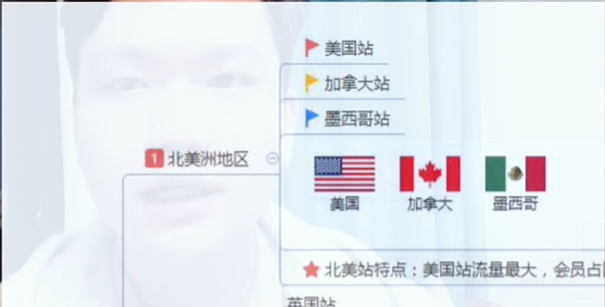

## 跨境电商
## 亚马逊电商教程

[牛津小马哥视频](https://www.bilibili.com/video/BV18y4y1a7iE/?spm_id_from=333.337.search-card.all.click&vd_source=ade47f4723248080479cf8996bc0c4b0)

选择北美站注册

找产品 `1688` `包牛牛` `优购` 这几个网站上都有跨境电商货源

产品：电热毯  销往北美

价格：国内：70元左右 通过平台销售到欧美国家 售价再83欧元左右 每一单200+的利润(人民币) 主要赚汇款差价  每月平均销量在180单左右(别人做的销量)

在3万多点的收益

这种模式是不需要吨货或者压钱

