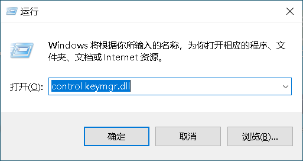
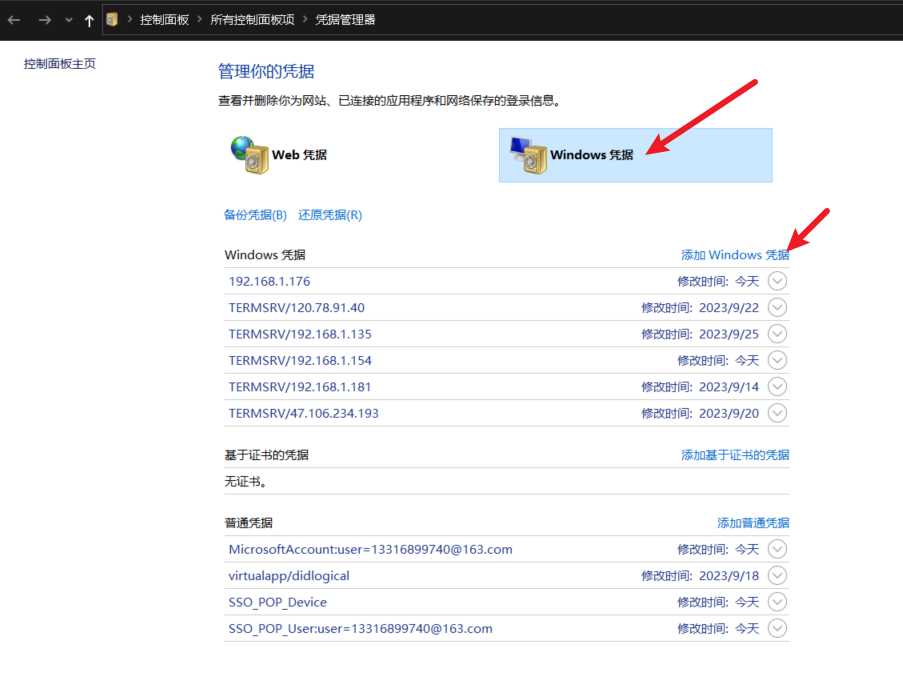
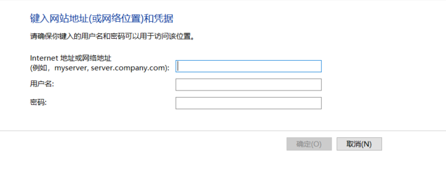
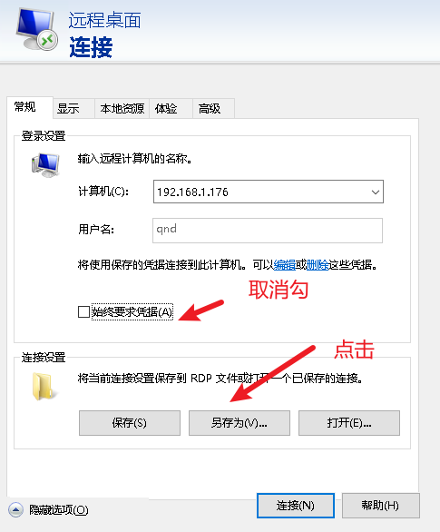
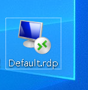
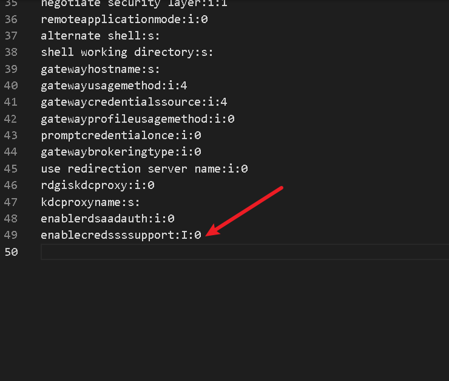

# 远程Windows10 电脑 显示请稍候 无法进入

现象:

# 解决方法

一、在要远程的电脑打开凭证管理器 按快捷键 " win + r " 在运行框中 输入  "control keymgr.dll" 回车

添加windows 凭据 填入要远程电脑的ip地址 用户名 密码 点击确定即可

二、设置远程桌面信息

在要远程的电脑打开远程桌面 按快捷键 " win + r " 在运行框中 输入  "mstsc" 回车

保存远程信息到桌面进行编辑

使用自己熟悉的编辑器打开这个.rdp结尾的文件，添加如下信息

# 再次远程即可连接成功
